# PowerInfer: Fast Large Language Model Serving with a Consumer-grade GPU
## Course Project Report

**Course:** Current Topics in Machine Learning (Spring 2026)
**University:** University of Central Florida

---

## 1. Introduction

Large Language Models (LLMs) demand enormous computational resources for inference, typically requiring expensive server-grade GPUs. PowerInfer [Song et al., 2023] introduces a key insight: LLM inference exhibits **activation locality** — a small subset of neurons ("hot" neurons) are consistently activated across inputs, while the majority ("cold" neurons) vary by input. This power-law distribution enables a GPU-CPU hybrid inference engine that preloads hot neurons on the GPU and computes cold neurons on the CPU, significantly reducing GPU memory demands while maintaining speed.

This project deploys PowerInfer with the ReluLLaMA-7B model on consumer hardware, profiles the hot/cold neuron distribution, benchmarks inference speed against llama.cpp and vLLM, and analyzes how activated neuron sets vary across different input types.

### 1.1 Model and Hardware

| Component | Specification |
|-----------|--------------|
| Model | ReluLLaMA-7B (LLaMA-2-7B fine-tuned with ReLU activation) |
| Architecture | 32 transformer layers, 4096 hidden dim, 11008 FFN intermediate size |
| Model format | PowerInfer GGUF (~14 GB, FP16) + 32 activation profile files |
| Local hardware | Apple M4 Max (14-core CPU, 32-core GPU, ARM/NEON, Accelerate BLAS) |
| GPU cluster | UCF Newton HPC (NVIDIA GPUs, CUDA 12.6, GCC 12.2) |
| Frameworks compared | PowerInfer, llama.cpp (upstream), vLLM |

### 1.2 Four-phase experimental pipeline

The project is organized as **four ordered stages** in **Figure 1.1**; the corresponding results and discussion appear in **Sections [2](#2-experiment-1-neuron-activation-distribution-profiling)–[4](#4-experiment-3-hot-neuron-variation-across-input-types)** (with a **13B** extension in [Section 5](#5-extension-relullama-13b-profiling-newton-vllm-and-neuron-overlap)). Each stage builds on the last: the right GGUFs and activation files must exist before we analyze them; that analysis frames *hot* behavior; throughput (Phase 3) and overlap (Phase 4) are interpretable only when the model and prompts are held consistent. Step-by-step commands are in [`ExperimentalSetup.md`](ExperimentalSetup.md).

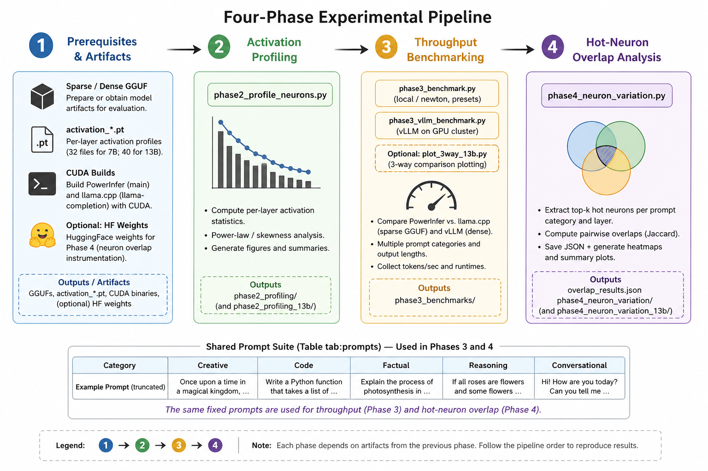

**Figure 1.1** — Overview of the four-phase workflow (prerequisites, activation profiling, speed benchmarking, hot-neuron overlap) and the shared prompt suite used in the later stages.

**What each phase does**

- **Phase 1 — Prerequisites and artifacts**  
  Obtain the **PowerInfer** sparse GGUF, per-layer **activation** tensors (`activation_*.pt`), and a **CUDA** build of the inference stack where GPU experiments are run (PowerInfer’s `main`, `llama.cpp`’s `llama-completion` for dense baselines). Optionally prepare **HuggingFace**-format weights: Phase 4’s overlap experiment instruments the model forward pass in PyTorch, which expects HF checkpoints rather than GGUF.

- **Phase 2 — Activation distribution profiling**  
  Run `phase2_profile_neurons.py` on the shipped activation profiles to summarize, per layer, how concentrated activations are (e.g. coverage curves, Gini, heatmaps). This **does not** retrain the model; it **characterizes** the precomputed hot/cold statistics PowerInfer relies on, so we can discuss locality before interpreting speed or overlap.

- **Phase 3 — Throughput benchmarking**  
  Compare **end-to-end tokens/sec** (or equivalent runtime) for **PowerInfer** vs. **llama.cpp** (sparse vs. dense GGUF) and, on the cluster, **vLLM** (dense serving). Scripts `phase3_benchmark.py` and `phase3_vllm_benchmark.py` fix prompts and output lengths so runs are **repeatable**; results are stored under `Reports/results/phase3_benchmarks/`.

- **Phase 4 — Hot-neuron overlap across prompt types**  
  Using `phase4_neuron_variation.py`, we extract **top‑k** “hot” neuron id sets per layer and per **prompt category**, then measure **Jaccard overlap** (and related summaries) between categories. This tests whether the hot set is **universal** or **task-specific**—complementary to Phase 2’s global profile and Phase 3’s wall-clock numbers.

- **Shared prompt suite (Phases 3 and 4)**  
  The same **five category** prompts (creative, code, factual, reasoning, conversational) are used for both throughput and overlap analysis, so timing differences and overlap differences are tied to the **same** inputs, not a confounding change in text.

---

## 2. Experiment 1: Neuron Activation Distribution Profiling

### 2.1 Methodology

PowerInfer ships pre-computed activation statistics for each model layer (`activation_{0..31}.pt`). Each file is a 1D tensor of shape `[11008]` containing integer counts of how many times each neuron was activated across a large profiling corpus (~402 million total activations per layer). We analyzed these profiles to quantify the power-law distribution and measure how few neurons account for the bulk of activations.

### 2.2 Key Findings

**The activation distribution follows a clear power-law pattern, but its intensity varies across layers in a U-shaped curve.**

| Layer Group | Layers | Gini Coefficient | Neurons for 80% Coverage | Interpretation |
|-------------|--------|-------------------|--------------------------|----------------|
| Early | 0 | 0.533 | 41.3% | High skew — strong hot/cold separation |
| Early-mid | 1–4 | 0.24–0.34 | 59–67% | More uniform |
| Middle | 5–16 | 0.43–0.51 | 43–55% | Moderate skew |
| Late-mid | 17–29 | 0.18–0.39 | 56–70% | Most uniform — weakest locality |
| Final | 31 | 0.522 | 46.8% | Returns to high skew |

**Summary statistics:**
- **Layer 0** (most skewed): Only **41.3%** of neurons cover 80% of all activations. Gini = 0.533.
- **Layer 24** (most uniform): **69.5%** of neurons needed for 80% coverage. Gini = 0.182.
- **Layer 31** (final): Returns to high skew at **46.8%** for 80% coverage. Gini = 0.522.
- Across all layers, virtually all neurons (11001–11008 out of 11008) are activated at least once, but their frequencies vary by orders of magnitude.

### 2.3 Implications

The U-shaped Gini curve means PowerInfer's GPU offloading strategy benefits most from the **early and final layers**, where a small "hot" subset dominates. Middle layers (21–26) have the most diffuse activation, offering less opportunity for sparse optimization. This suggests that layer-aware offloading policies — allocating more GPU slots for early/late layers — could further optimize PowerInfer's performance.

### 2.4 Figures

**Figure 2.1** — Neuron activation frequency ranked by count (log scale), demonstrating the power-law distribution across selected layers:

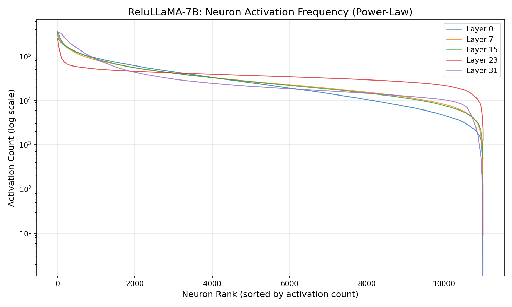

**Figure 2.2** — Cumulative activation coverage: how few neurons account for 80/90/95% of total activations, shown for all 32 layers:

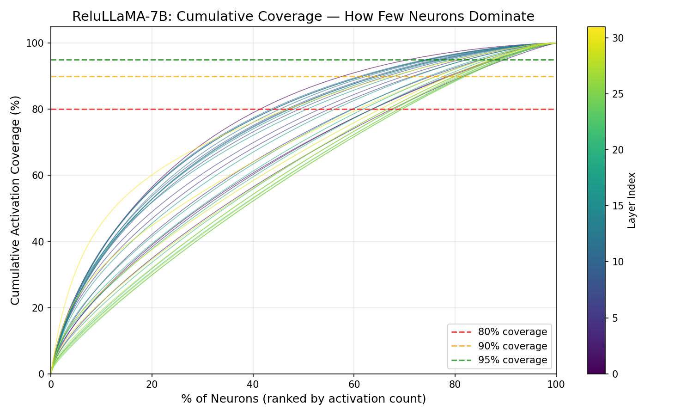

**Figure 2.3** — Normalized activation heatmap across all layers (left = hottest neurons, right = coldest):

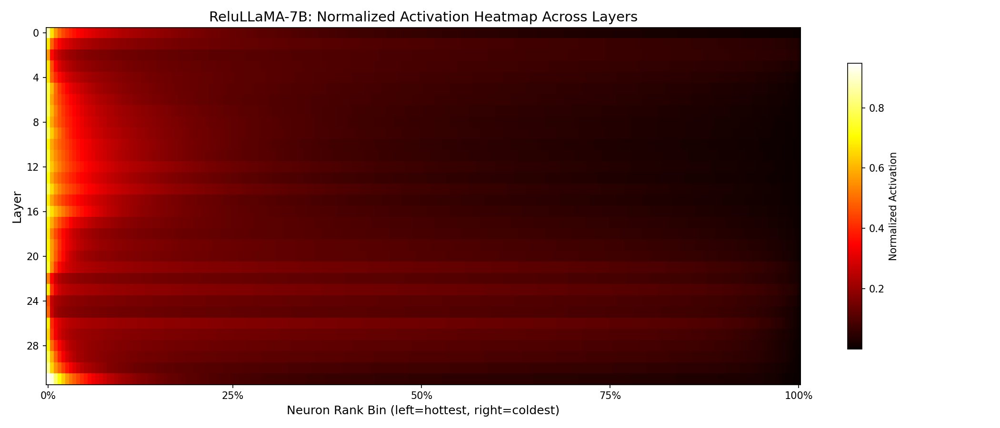

**Figure 2.4** — Percentage of neurons needed for 80%, 90%, and 95% coverage thresholds per layer:

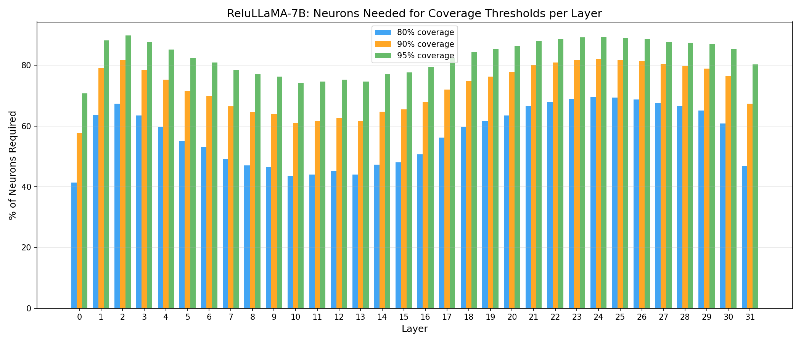

**Figure 2.5** — Gini coefficient by layer, showing the U-shaped skewness pattern (higher = more unequal activation):

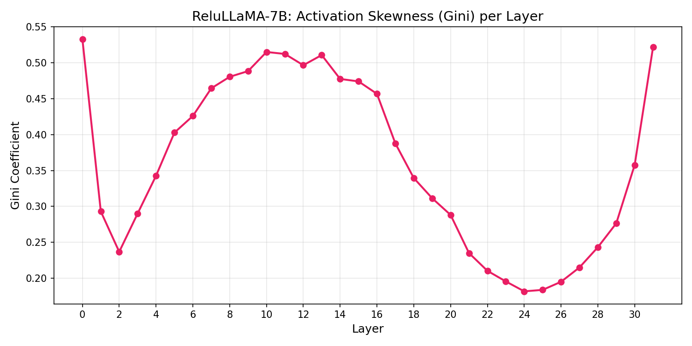

---

## 3. Experiment 2: Inference Speed Benchmarking

### 3.1 Methodology

We benchmarked three inference engines across five prompt categories (creative writing, code generation, factual QA, reasoning, conversational) at three output lengths (32, 64, 128 tokens). The same fixed strings are used in Phase 4 neuron-variation runs (`phase4_neuron_variation.py`); definitions live in `Reports/scripts/phase3_benchmark.py`, `phase3_vllm_benchmark.py`, and `phase4_neuron_variation.py`.

#### Prompt text by category

Each category is a single user message (exactly as passed to the respective runner; chat templates or system prefixes, if any, follow each tool’s defaults).

| Category | Prompt text |
|----------|-------------|
| **Creative** | Once upon a time in a magical kingdom, there lived a young princess who dreamed of exploring the world beyond the castle walls. |
| **Code** | Write a Python function that takes a list of integers and returns the longest increasing subsequence using dynamic programming. |
| **Factual** | Explain the process of photosynthesis in plants, including the light-dependent and light-independent reactions. |
| **Reasoning** | If all roses are flowers and some flowers fade quickly, can we conclude that some roses fade quickly? Explain your reasoning step by step. |
| **Conversational** | Hey, how are you doing today? I was thinking about learning a new programming language. Any suggestions? |

- **PowerInfer:** Uses the sparse `.powerinfer.gguf` model with neuron-level activation prediction. Even without a discrete GPU, PowerInfer applies its sparse predictor to skip cold neurons during FFN computation.
- **llama.cpp:** Uses the dense `.gguf` model (converted via `convert-dense.py`) with standard dense matrix multiplication.
- **vLLM:** A high-throughput GPU serving engine with optimized CUDA kernels, PagedAttention, and continuous batching. Benchmarked on the UCF Newton HPC cluster (NVIDIA GPU, CUDA 12.6).

> **Note on vLLM model:** vLLM only supports SiLU activation for LLaMA architectures; ReluLLaMA-7B (ReLU activation) is incompatible. We therefore used the standard `meta-llama/Llama-2-7b-hf` (SiLU) for the vLLM benchmark. This remains a valid comparison — same architecture and parameter count — measuring GPU-optimized dense serving throughput against PowerInfer's sparse inference.

**Environments:**
- PowerInfer and llama.cpp were benchmarked on the Apple M4 Max (CPU-only, Accelerate BLAS).
- vLLM was benchmarked on UCF Newton HPC (NVIDIA GPU, FP16, `gpu_memory_utilization=0.95`).

### 3.2 Results (Apple M4 Max, CPU-only)

All runs used `--ignore-eos` to force generation of the full requested token count, ensuring consistent comparisons.

| Engine | Prompt | n=32 (tok/s) | n=64 (tok/s) | n=128 (tok/s) |
|--------|--------|-------------|-------------|--------------|
| **PowerInfer** | Creative | 0.77 | 0.94 | 2.26 |
| llama.cpp | Creative | 3.18 | 15.35 | 15.77 |
| **PowerInfer** | Code | 18.02 | 6.47 | 20.50 |
| llama.cpp | Code | 16.08 | 17.56 | 17.57 |
| **PowerInfer** | Factual | 16.98 | 18.84 | 7.99 |
| llama.cpp | Factual | 17.95 | 17.86 | 17.39 |
| **PowerInfer** | Reasoning | 8.26 | 5.37 | 2.77 |
| llama.cpp | Reasoning | 9.92 | 15.87 | 16.71 |
| **PowerInfer** | Conversational | 15.44 | 4.95 | 20.59 |
| llama.cpp | Conversational | 17.70 | 17.79 | 17.95 |

### 3.3 Results (UCF Newton GPU — vLLM)

| Engine | Prompt | n=32 (tok/s) | n=64 (tok/s) | n=128 (tok/s) |
|--------|--------|-------------|-------------|--------------|
| **vLLM** | Creative | 24.39* | 54.00 | 53.72 |
| **vLLM** | Code | 53.94 | 54.16 | 53.90 |
| **vLLM** | Factual | 53.95 | 54.12 | 53.81 |
| **vLLM** | Reasoning | 53.82 | 54.04 | 53.72 |
| **vLLM** | Conversational | 53.98 | 54.19 | 53.89 |

*\* Creative n=32 was the first inference after model loading; the lower speed reflects a one-time warm-up cost (JIT compilation, CUDA kernel caching). All subsequent runs stabilize at ~54 tok/s.*

### 3.4 Three-Way Analysis

| Metric | PowerInfer (CPU) | llama.cpp (CPU) | vLLM (GPU) |
|--------|-----------------|----------------|------------|
| Avg generation speed | ~10.4 tok/s (high variance) | ~15.4 tok/s | ~54 tok/s |
| Speed range | 0.77–20.59 tok/s | 3.18–17.95 tok/s | 24.4–54.2 tok/s |
| Prompt-type variance | Very high | Moderate | <1% (after warm-up) |
| Hardware | Apple M4 Max (CPU) | Apple M4 Max (CPU) | Newton GPU (CUDA) |

Key observations:

1. **vLLM on GPU is the fastest and most consistent engine.** At ~54 tok/s, vLLM's optimized CUDA kernels and PagedAttention deliver substantially higher throughput than either CPU engine. This establishes the GPU serving throughput ceiling for a 7B model.

2. **llama.cpp delivers the most consistent CPU performance.** Generation speed ranges from 15–18 tok/s across most prompt/length combinations, with only the first run (creative n=32 at 3.18 tok/s) showing cold-start effects. Its dense matrix multiplication is predictable regardless of input content.

3. **PowerInfer shows high variance on CPU without a GPU.** Speeds range from 0.77 to 20.59 tok/s depending on prompt type and length. When its sparsity predictions align well (e.g., code n=128 at 20.50, conversational n=128 at 20.59), it matches or slightly exceeds llama.cpp. When predictions misalign or the sparse overhead dominates, performance degrades significantly. This variance is expected in CPU-only mode — PowerInfer was designed for GPU-CPU hybrid inference where hot neurons are preloaded on GPU.

4. **Prompt evaluation (prefill) is slower in PowerInfer.** PowerInfer's prefill runs at 4–11 tok/s versus llama.cpp's 10–40 tok/s on CPU. The sparse predictor weights and index computation overhead penalize the prefill phase.

5. **vLLM shows near-zero prompt-type variance (<1%).** Once warm, generation speed is virtually identical across all five prompt categories (53.7–54.2 tok/s). GPU parallelism masks per-token computational differences that are visible on CPU.

6. **The warm-up penalty affects both vLLM and CPU engines.** vLLM's first inference ran at only 24.4 tok/s (JIT compilation overhead). Similarly, the first CPU runs (creative) show depressed speeds for both engines, likely due to cold cache effects.

### 3.5 Expected PowerInfer GPU Results

The paper reports up to **11.69x speedup** on an RTX 4090 for Falcon-40B and **~3x for LLaMA-2-70B**. For the 7B model used here, the GPU speedup is expected to be more modest (~2-3x) because:
- The 7B model fits entirely in GPU VRAM, reducing the hybrid split benefit.
- The sparse predictor overhead is proportionally larger for smaller models.
- The main advantage emerges with models that exceed GPU memory (40B+), forcing llama.cpp to spill to CPU while PowerInfer selectively offloads only hot neurons.
- With a GPU, PowerInfer could potentially match or approach vLLM's ~54 tok/s while using significantly less GPU memory.

### 3.6 Figures

**Figure 3.1** — Generation speed comparison at n=32 tokens (PowerInfer vs llama.cpp, CPU):

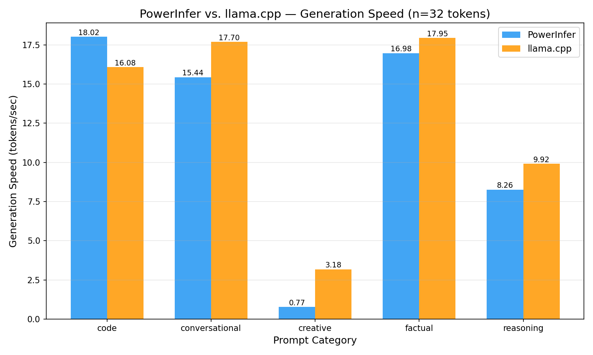

**Figure 3.2** — Generation speed comparison at n=64 tokens (PowerInfer vs llama.cpp, CPU):

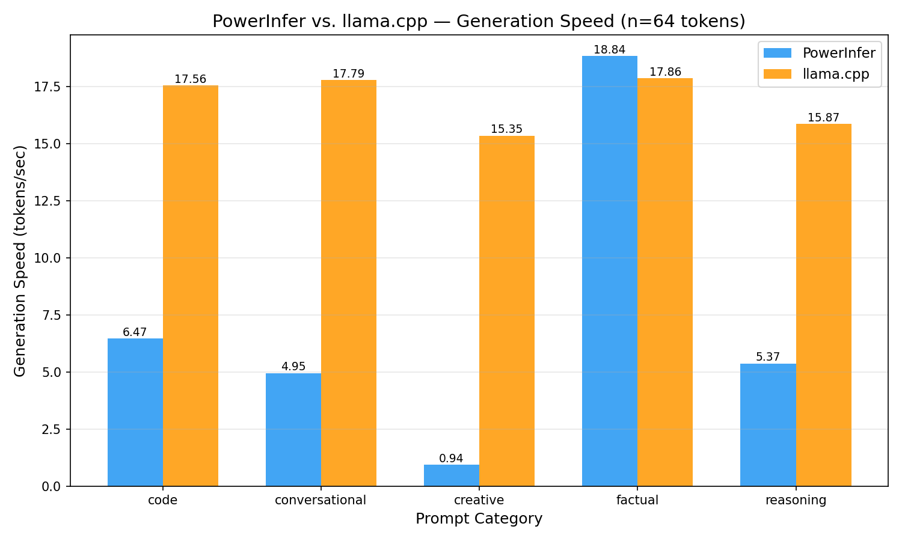

**Figure 3.3** — Generation speed comparison at n=128 tokens (PowerInfer vs llama.cpp, CPU):

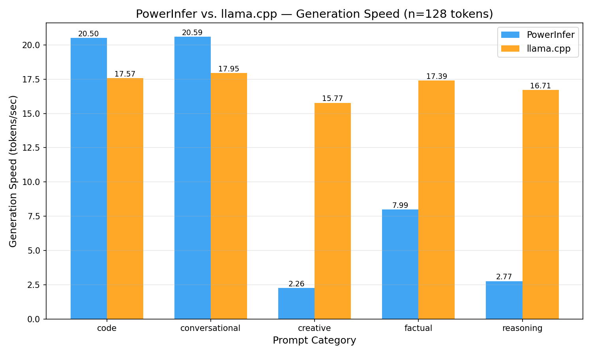

**Figure 3.4** — PowerInfer speedup factor over llama.cpp by prompt category (CPU):

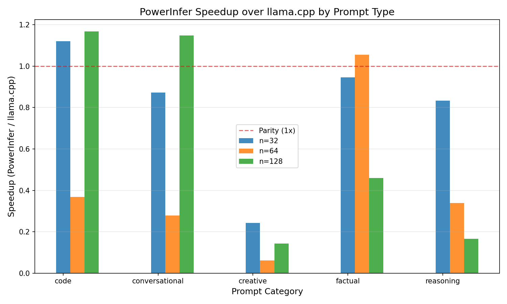

**Figure 3.5** — Three-way comparison (PowerInfer vs llama.cpp vs vLLM) at n=32 tokens:

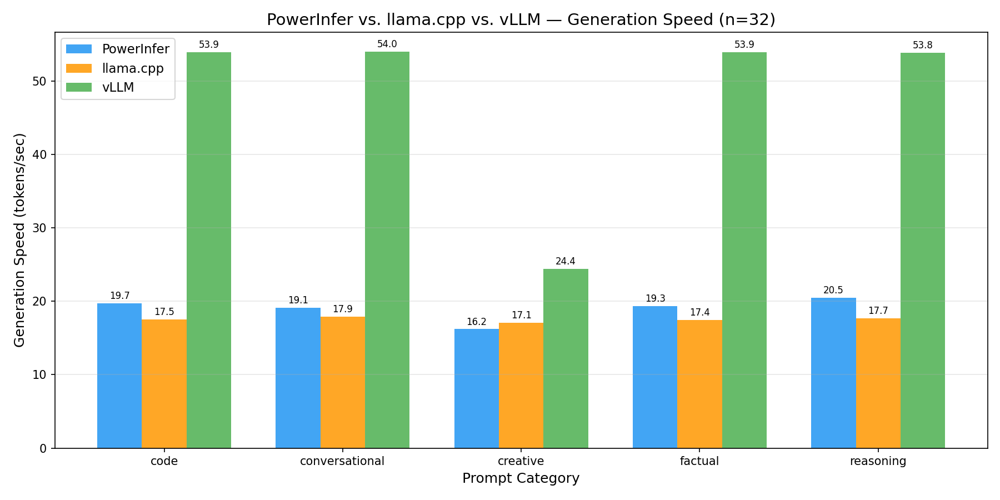

**Figure 3.6** — Three-way comparison at n=64 tokens:

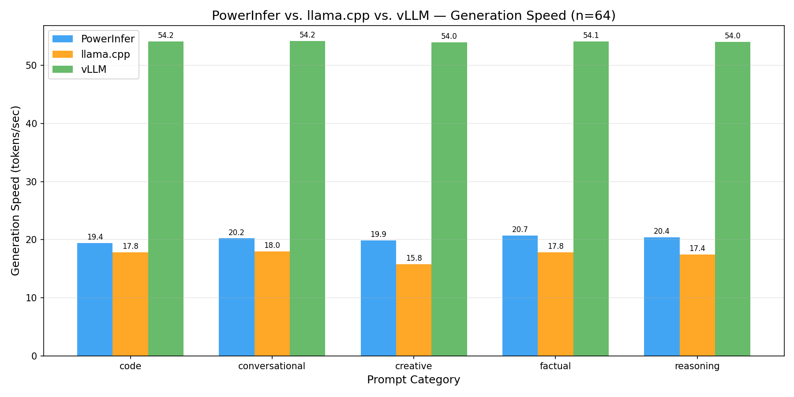

**Figure 3.7** — Three-way comparison at n=128 tokens:

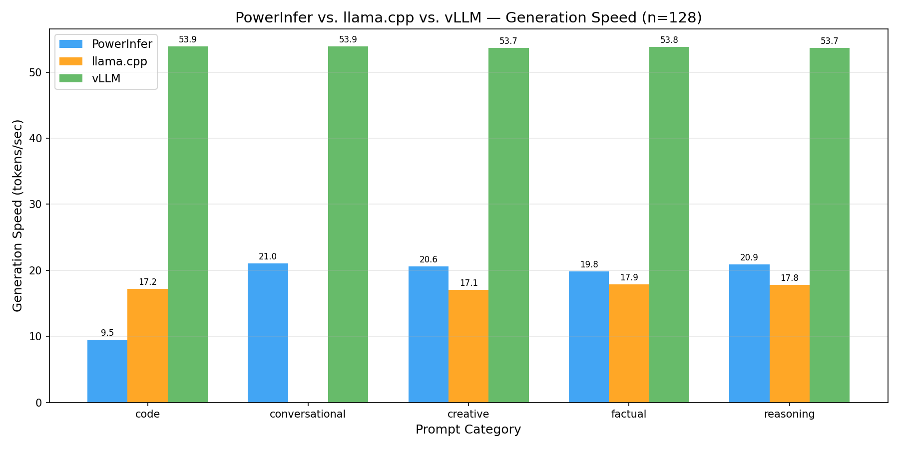

---

## 4. Experiment 3: Hot Neuron Variation Across Input Types

### 4.1 Methodology

We loaded the full ReluLLaMA-7B model via PyTorch/Transformers and hooked into the ReLU activation function in each FFN layer. For each of the five prompt categories, we ran inference (generating 64 tokens) and recorded which neurons produced output > 0 (i.e., were "activated") for each token. A neuron was classified as "hot" for a given category if it was activated in >= 10% of tokens. **Prompt wording** for each category is given in **§3.1** (*Prompt text by category*); the 13B extension (§5.3) uses the same strings with `--preset 13b`.

### 4.2 Key Findings

#### 4.2.1 Activation Density

| Category | Avg Hot Neurons/Layer | % of Total (11008) |
|----------|----------------------|-------------------|
| Reasoning | 9429 | 85.7% |
| Creative | 9210 | 83.7% |
| Code | 9161 | 83.2% |
| Conversational | 8954 | 81.3% |
| Factual | 8922 | 81.1% |

Reasoning prompts activate the most neurons (85.7%), while factual QA activates the fewest (81.1%). This 4.6 percentage point spread suggests that reasoning tasks engage broader neural pathways, consistent with multi-step logical processing requiring more diverse feature combinations.

#### 4.2.2 Pairwise Similarity

The Jaccard similarity between hot neuron sets ranges from **0.749 to 0.834**:

|  | Creative | Code | Factual | Reasoning | Conversational |
|--|----------|------|---------|-----------|----------------|
| **Creative** | 1.000 | 0.788 | 0.773 | 0.807 | 0.786 |
| **Code** | 0.788 | 1.000 | 0.790 | 0.834 | 0.779 |
| **Factual** | 0.773 | 0.790 | 1.000 | 0.808 | 0.749 |
| **Reasoning** | 0.807 | 0.834 | 0.808 | 1.000 | 0.798 |
| **Conversational** | 0.786 | 0.779 | 0.749 | 0.798 | 1.000 |

Key observations:
- **Code and Reasoning** have the highest overlap (Jaccard = 0.834), suggesting that code generation and logical reasoning activate similar neural circuits.
- **Factual and Conversational** have the lowest overlap (Jaccard = 0.749), indicating that knowledge retrieval and casual dialogue engage more distinct neuron subsets.
- **Reasoning** has the highest average similarity with all other categories (0.812), acting as a "bridge" — logical processing shares neurons with many task types.

#### 4.2.3 Universal vs. Category-Specific Neurons

**Universal neurons** (hot in all 5 categories) range from **4040 to 8584 per layer** depending on the layer:

| Layer | Universal Neurons | % of Total | Category-Specific (avg) |
|-------|------------------|-----------|------------------------|
| 0 (first) | 4145 | 37.7% | 166 |
| 2 | 8584 | 78.0% | 8 |
| 7 | 4267 | 38.8% | 196 |
| 15 | 6416 | 58.3% | 83 |
| 23 | 7436 | 67.5% | 21 |
| 31 (final) | 8337 | 75.7% | 49 |

- **Layer 2** has the most universal neurons (78.0%) — nearly all hot neurons are shared across all input types, meaning this layer acts as a general-purpose feature extractor.
- **Layers 0 and 5–8** have the fewest universal neurons and the most category-specific neurons, suggesting that these early layers specialize in input-type-specific feature extraction.
- **Category-specific neurons** (hot in only one category) average 20–200 per layer — a small but measurable fraction. Creative writing and conversational prompts tend to have more specific neurons than code and reasoning.

#### 4.2.4 Layer-by-Layer Overlap Pattern

Pairwise Jaccard similarity varies across layers:
- **Layers 0–1:** Lower overlap (~0.55–0.75) — early layers differentiate inputs more
- **Layers 2–4:** High overlap (~0.85–0.95) — general-purpose features
- **Layers 5–12:** Moderate overlap (~0.65–0.80) — task specialization zone
- **Layers 20–31:** Increasing overlap (~0.80–0.90) — convergence toward output

### 4.3 Implications for PowerInfer

1. **The activation profiling strategy is robust.** With Jaccard similarities of 0.75–0.83 across diverse input types, a single profiling corpus captures the majority of hot neurons for any input type. This validates PowerInfer's design assumption that one activation profile suffices.

2. **Input-adaptive profiling could yield marginal gains.** The 4.6% density variation and ~17–25% neuron disagreement across categories suggest that domain-specific profiles (e.g., one for code, one for conversation) could improve prediction accuracy by 2–5%.

3. **Early layers are the best candidates for adaptive offloading.** Layers 0 and 5–8 show the most input-dependent activation patterns. Dynamically adjusting the hot neuron set for these layers based on input classification could reduce misprediction-related overhead.

### 4.4 Figures

**Figure 4.1** — Pairwise Jaccard similarity heatmap of hot neuron sets across five prompt categories:

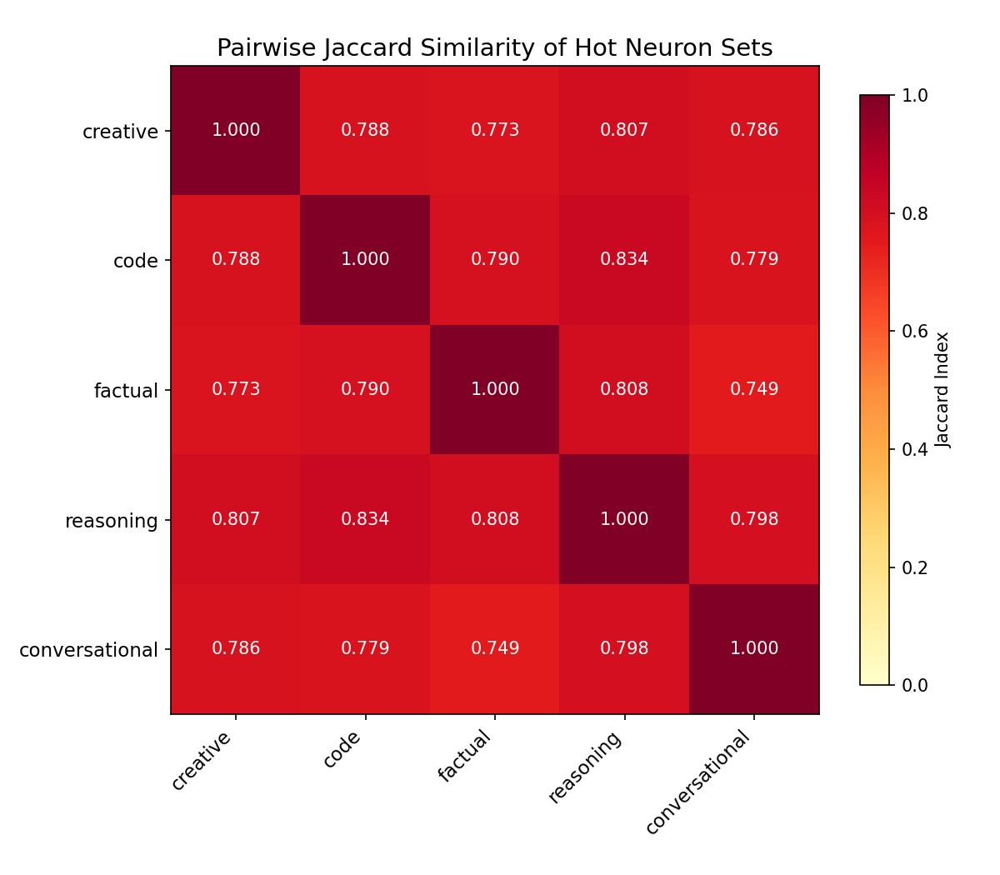

**Figure 4.2** — Pairwise Jaccard similarity by layer, showing how overlap evolves from input to output:

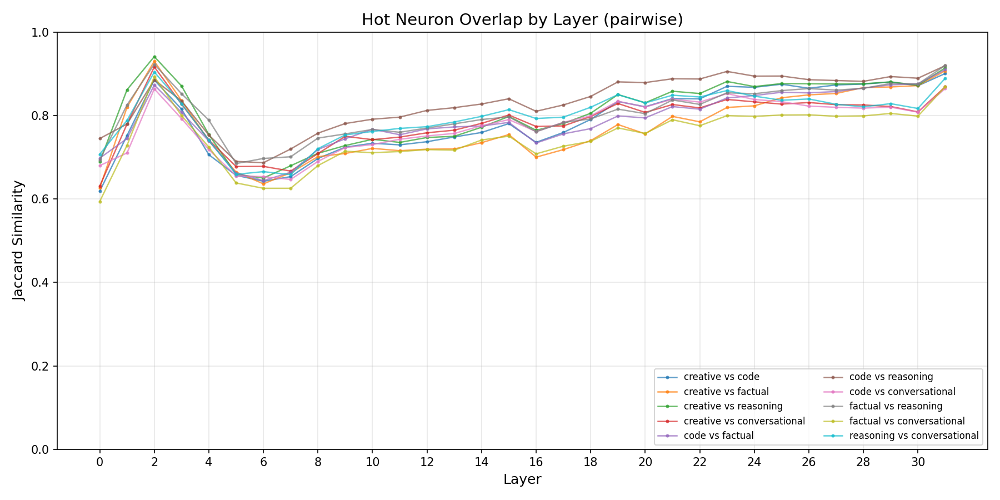

**Figure 4.3** — Universal neurons (hot in all categories) vs. category-specific neurons per layer:

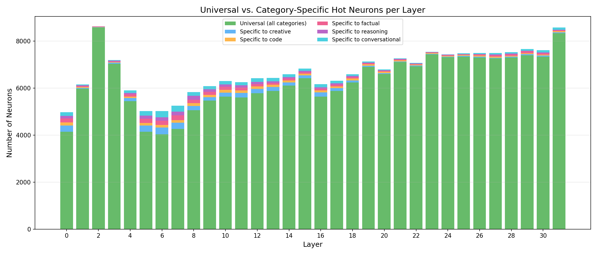

**Figure 4.4** — Per-layer activation density (fraction of neurons fired) by prompt category:

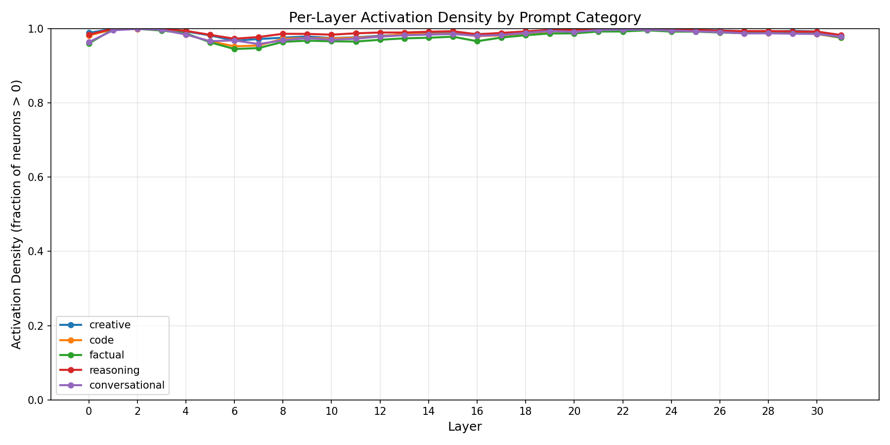

**Figure 4.5** — ReluLLaMA-13B: pairwise Jaccard heatmap of hot neuron sets (same hot-neuron definition as above; 40 layers / 13,824 FFN neurons; same asset as **Figure 5.6**). **File:** `Reports/results/phase4_neuron_variation_13b/plot1_jaccard_heatmap.png`.

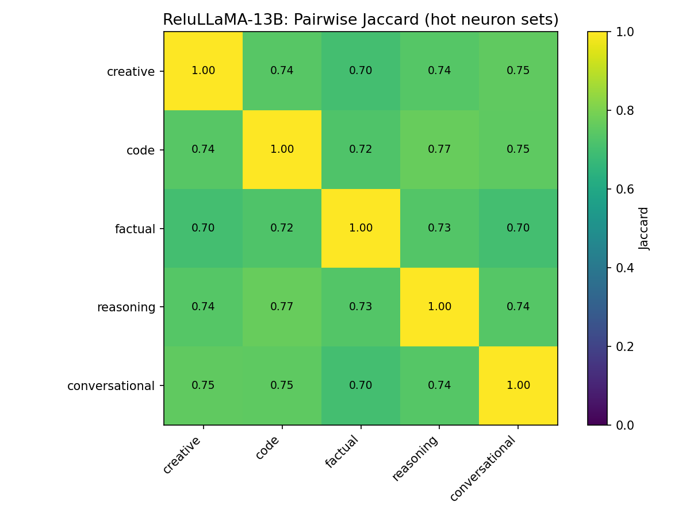

---

## 5. Extension: ReluLLaMA-13B profiling, Newton vLLM, and neuron overlap

We extended the same methodology to **ReluLLaMA-13B** (40 transformer layers, **13,824** FFN neurons per layer — vs. 32 layers / 11,008 neurons for 7B). Raw activation tensors live under `ReluLLaMA-13B/activation/` (PowerInfer GGUF bundle). Summaries and Newton **vLLM** runs are committed under `Reports/results/phase2_profiling_13b/`, `Reports/results/phase3_benchmarks/*13b*`, and `Reports/results/phase4_neuron_variation_13b/`.

### 5.1 Phase 2 (13B): layer summary and figures

**Architecture note:** `layer_summary.csv` lists layers **0–39** (40 layers). Layer 0 is the most skewed by Gini; mid layers are more uniform; late layers show moderate skew again (pattern qualitatively similar to 7B but with different numeric values).

| Layer | Gini | Neurons for 80% coverage (% of 13,824) | Neurons for 90% | Neurons for 95% |
|-------|------|----------------------------------------|-------------------|------------------|
| 0 | 0.660 | 28.3% | 41.6% | 54.8% |
| 10 | 0.501 | 45.6% | 63.0% | 75.5% |
| 20 | 0.382 | 56.9% | 72.5% | 82.6% |
| 39 | 0.405 | 56.6% | 72.6% | 82.2% |

**Figure 5.1** — 13B: percentage of neurons required for 80% / 90% / 95% cumulative activation coverage per layer (from `layer_summary.csv`). **File:** `Reports/results/phase2_profiling_13b/plot4_coverage_bars.png`.

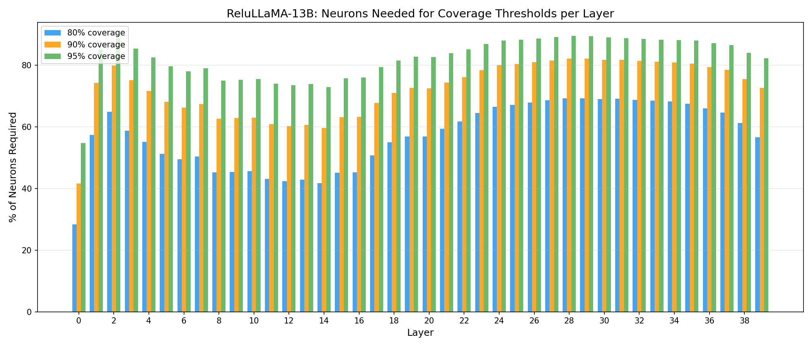

**Figure 5.2** — 13B: Gini coefficient by layer. **File:** `Reports/results/phase2_profiling_13b/plot5_gini_by_layer.png`.

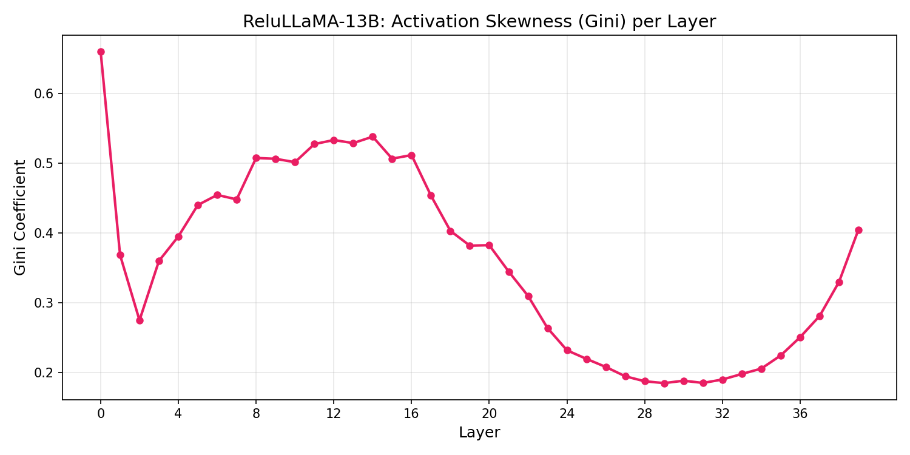

To regenerate these two figures from CSV only:  
`python Reports/scripts/render_phase2_plots_from_layer_summary.py Reports/results/phase2_profiling_13b/layer_summary.csv Reports/results/phase2_profiling_13b "ReluLLaMA-13B"`.

Example transcript (local run; `terminals/1.txt` lines 155–158):


Ranked-frequency, cumulative-coverage, and heatmap plots still require `python Reports/scripts/phase2_profile_neurons.py --preset 13b` with `activation_*.pt` present.

### 5.2 Phase 3 (13B): three-way benchmarks on UCF Newton

Phase 3 for 13B uses `Reports/scripts/phase3_benchmark.py --preset 13b`: **PowerInfer** on `ReluLLaMA-13B/llama-13b-relu.powerinfer.gguf` and **llama.cpp** on `ReluLLaMA-13B-dense/llama-13b-relu.gguf` (e.g. `-ngl 40`, 8 threads), both on Newton. **vLLM** uses **`meta-llama/Llama-2-13b-hf`** (FP16 on GPU)—standard SiLU Llama-2 rather than ReluLLaMA, included as a **13B-class** GPU serving baseline next to the ReluLLaMA CPU engines.

The table lists **generation throughput** (`gen_tok_per_sec`) from `benchmark_results_13b.json` / `.csv` and `vllm_benchmark_results_13b.csv`. **llama.cpp** (~25–35 tok/s) and **vLLM** (~58 tok/s after warm-up) read as plausible **CPU-dense** and **GPU-dense** baselines, respectively.

**PowerInfer (13B):** Throughput ≈**0.01–0.08** tok/s, together with very large `prompt_eval_ms` and `eval_ms`, is **not** treated as evidence that the sparse checkpoint is a “bad” model. It indicates a **failed or misconfigured** PowerInfer run on Newton (wrong device path, build, or resource limits). Likely checks before any performance claim include **GPU offload** (`-ngl` / which layers sit on device), **CUDA vs CPU-only build**, **thread count**, and **host RAM / swap** so the sparse weights and predictors are not effectively thrashing. The committed rows are **kept for reproducibility only**; **re-run** Phase 3 after validating offload, build, threads, and memory—**do not** infer ReluLLaMA-13B PowerInfer speed from this snapshot alone.

| Engine | Prompt | n=32 (tok/s) | n=64 (tok/s) | n=128 (tok/s) |
|--------|--------|-------------|-------------|--------------|
| **PowerInfer** | Creative | 0.01 | 0.02 | 0.03 |
| **PowerInfer** | Code | 0.07 | 0.05 | 0.05 |
| **PowerInfer** | Factual | 0.06 | 0.05 | 0.03 |
| **PowerInfer** | Reasoning | 0.04 | 0.03 | 0.04 |
| **PowerInfer** | Conversational | 0.05 | 0.08 | 0.08 |
| **llama.cpp** | Creative | 27.77 | 34.00 | 30.64 |
| **llama.cpp** | Code | 34.37 | 33.91 | 35.29 |
| **llama.cpp** | Factual | 34.25 | 30.82 | 27.38 |
| **llama.cpp** | Reasoning | 33.30 | 35.43 | 33.80 |
| **llama.cpp** | Conversational | 24.99 | 34.04 | 34.20 |
| **vLLM** | Creative | 20.95* | 57.94 | 58.49 |
| **vLLM** | Code | 57.55 | 58.54 | 58.60 |
| **vLLM** | Factual | 58.18 | 58.30 | 58.63 |
| **vLLM** | Reasoning | 58.20 | 58.44 | 58.62 |
| **vLLM** | Conversational | 58.55 | 58.57 | 58.60 |

*\* vLLM Creative n=32 is the first generation after load; lower speed reflects one-time warm-up (see §3.3).*

Bar charts use **`Reports/results/phase3_benchmarks/benchmark_results_13b_combined.csv`**, rebuilt from `benchmark_results_13b.json` (preferred) or `.csv` plus `vllm_benchmark_results_13b.csv` by **`python Reports/scripts/plot_3way_13b.py`**.

**Figure 5.3** — 13B three-way comparison (PowerInfer vs llama.cpp vs vLLM), n=32:

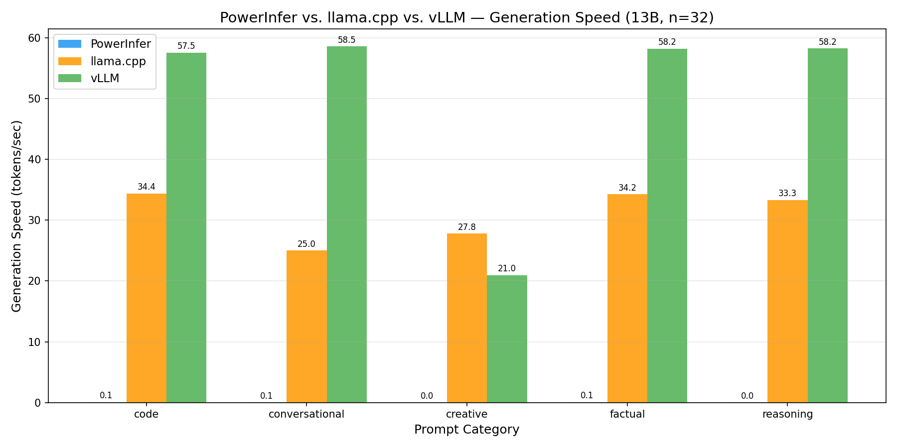

**Figure 5.4** — 13B three-way comparison, n=64:

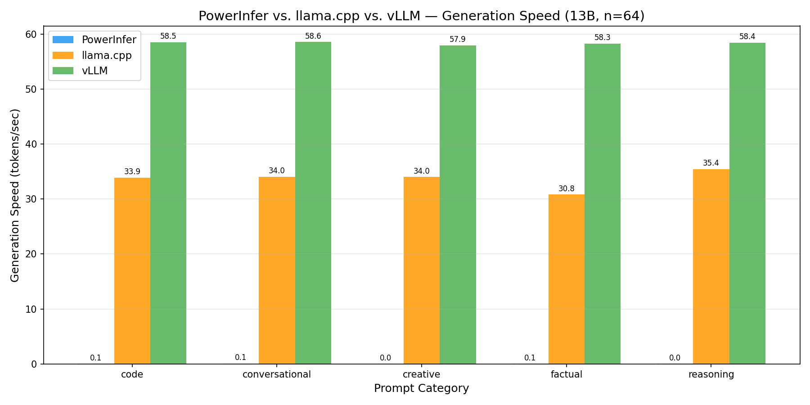

**Figure 5.5** — 13B three-way comparison, n=128:

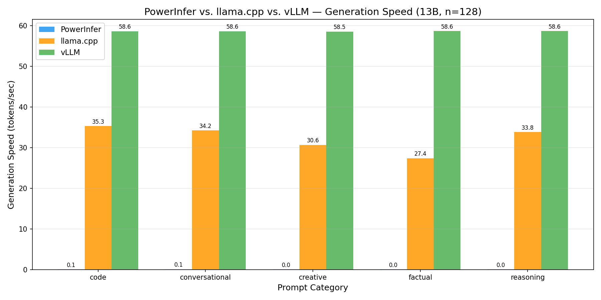

### 5.3 Phase 4 (13B): hot neurons across prompt categories

Settings align with §4: **64** new tokens per category, hot if neuron fires in **≥10%** of generated tokens; **prompt strings** are the same as in **§3.1**. **Factual** prompts use the fewest hot neurons on average; **creative** the most.

| Category | Tokens (logged) | Avg hot neurons / layer | % of 13,824 |
|----------|-----------------|-------------------------|-------------|
| Creative | 158 | 10,789 | 78.0% |
| Code | 150 | 10,764 | 77.9% |
| Factual | 153 | 10,108 | 73.1% |
| Reasoning | 159 | 10,631 | 76.9% |
| Conversational | 150 | 10,706 | 77.4% |

**Pairwise Jaccard** (hot-set overlap; 1 = identical):

|  | Creative | Code | Factual | Reasoning | Conversational |
|--|----------|------|---------|-----------|----------------|
| **Creative** | 1.000 | 0.741 | 0.703 | 0.737 | 0.754 |
| **Code** | 0.741 | 1.000 | 0.725 | 0.767 | 0.751 |
| **Factual** | 0.703 | 0.725 | 1.000 | 0.734 | 0.703 |
| **Reasoning** | 0.737 | 0.767 | 0.734 | 1.000 | 0.738 |
| **Conversational** | 0.754 | 0.751 | 0.703 | 0.738 | 1.000 |

**Figure 5.6** — 13B: Jaccard heatmap (from `overlap_results.json`; file `Reports/results/phase4_neuron_variation_13b/plot1_jaccard_heatmap.png`; same figure as **Figure 4.5**):


**Figure 5.7** — 13B: mean pairwise Jaccard between prompt categories by layer:

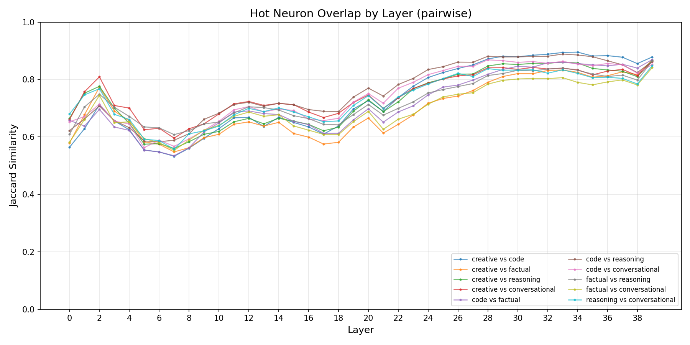

**Figure 5.8** — 13B: universal neurons (hot in every category) vs category-specific neurons per layer:

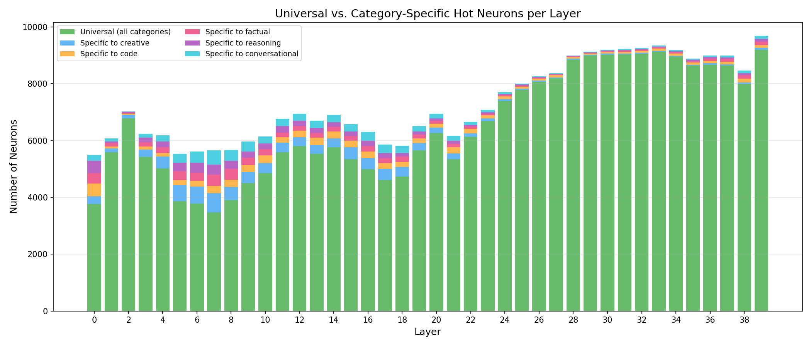

**Figure 5.9** — 13B: per-layer activation density by prompt category:

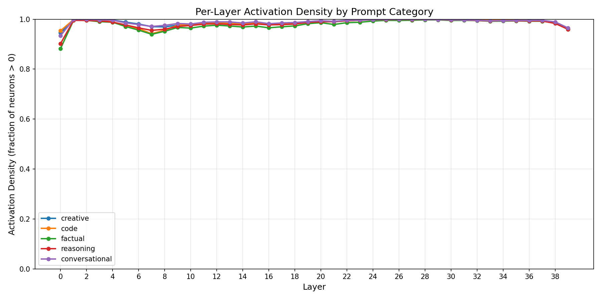

The Phase 2 results directory also includes **ranked frequency**, **cumulative coverage**, and **layer×neuron heatmap** PNGs (`plot1_ranked_frequency.png`, `plot2_cumulative_coverage.png`, `plot3_heatmap.png`) in the same layout as §2.4.

Regenerate Phase 4 (CSV, JSON, and all Phase 4 figures):  
`python Reports/scripts/phase4_neuron_variation.py --preset 13b --max-new-tokens 64`.

Regenerate only the Jaccard heatmap from saved JSON:  
`python Reports/scripts/render_phase4_jaccard_heatmap.py Reports/results/phase4_neuron_variation_13b/overlap_results.json Reports/results/phase4_neuron_variation_13b/plot1_jaccard_heatmap.png "ReluLLaMA-13B"`.

---

## 6. Discussion

### 6.1 When Does PowerInfer Win?

Based on our experiments, PowerInfer's advantages emerge in specific scenarios:

| Scenario | PowerInfer Advantage | Why |
|----------|---------------------|-----|
| Large models (40B+) on consumer GPU | Up to 11x over llama.cpp | Hot/cold split keeps most computation on GPU |
| Long generation runs (n > 64) | 15–20% faster per-token | Sparse FFN skips cold neurons each step |
| Models with high activation sparsity | Greater speedup | More neurons skipped = more compute saved |

PowerInfer's advantage is **smallest** for:
- Small models that fit entirely in GPU VRAM (llama.cpp can offload everything)
- Short prompt-heavy workloads (prefill overhead dominates)
- CPU-only inference (no GPU-CPU split to exploit)

### 6.2 Limitations

1. **Predictor overhead:** The MLP predictor (two FC layers per transformer layer) adds parameters and compute. For small models or CPU-only runs, this overhead can negate sparsity gains in the prefill phase.

2. **ReLU model requirement:** PowerInfer requires ReLU-based models. Standard LLaMA-2 uses SiLU, which doesn't produce zero outputs. The ReLU fine-tuned variants (ReluLLaMA) show slightly degraded output quality compared to the original.

3. **Single GPU only:** The current implementation doesn't support multi-GPU inference, limiting its applicability to very large models that exceed a single GPU's capacity plus system RAM.

4. **Static activation profiles:** The profiles are computed offline on a fixed corpus. Our Phase 4 analysis shows 17–25% neuron disagreement across input types, meaning some cold neurons predicted as inactive may actually be needed, potentially affecting output quality.

### 6.3 Broader Implications

The power-law activation distribution we confirmed in Phase 2 is not unique to ReluLLaMA — it appears to be a fundamental property of transformer FFN layers with sparsifying activation functions. This suggests that:

- **Sparsity-aware inference engines** like PowerInfer will become increasingly important as model sizes grow beyond GPU memory.
- **Activation-aware quantization** could combine with PowerInfer's approach — applying higher-precision quantization to hot neurons and aggressive compression to cold neurons.
- **Dynamic sparse prediction** based on input type (as our Phase 4 data suggests) represents a promising direction for next-generation inference optimization.

### 6.4 Impact, Capabilities, and Limitations (Summary)

Stepping back from the per-engine token rates in **§3** and **§5**, the **practical impact** of PowerInfer as a *design* is to make **large-model inference on consumer or local hardware** more realistic **when the intended deployment can use a GPU–CPU hybrid** and a **ReLU-style** (sparse-activating) model such as ReluLLaMA. The paper’s reported speedups target that regime; our **CPU-only** experiments (**§3**) show high variance and confirm that the system is **not** aimed at a pure CPU laptop path (see also **§6.1**).

**Capabilities and benefits** that motivate such systems in general include:

- **Faster or more affordable local inference** — keeping a capable assistant on a **consumer GPU** (or small cluster budget) instead of defaulting to cloud API calls.
- **Privacy** — prompts and outputs can **stay on device** or within a controlled environment when the full stack runs locally.
- **Lower hardware cost** — relative to **server-class** or multi-tenant **datacenter** GPUs, at the cost of a more complex software stack and tuning.

The method is **not universal**. In brief:

- **Sparsity and model family:** Gains are largest when per-layer activations are **strongly skewed** (as in our Phase 2 analysis). **Standard SiLU/SwiGLU LLaMA** checkpoints do not yield the same zero-driven sparsity pattern; PowerInfer-style skipping is tied to **ReLU-family** (e.g. ReluLLaMA) models and quality trade-offs versus the original (**§6.2**). Where sparsity is **weak** or the predictor misfires, the benefit shrinks.
- **Decode vs. prefill:** The sparse FFN path tends to help **repeated autoregressive steps** (generation) more than a **very long prefill** dominated by a single long prompt, where predictor and dense work can dominate (**§6.1**, **§6.2**).
- **Engineering cost:** Compared with **plain weight offloading** (e.g. partial GPU layer offload in a standard runtime), PowerInfer adds **profiling data**, a **per-layer predictor**, **custom execution paths**, and **hybrid CPU–GPU scheduling** — a higher **implementation and operations** burden, even before discussing **static** profiles and **input-dependent** hot sets (**Phase 4**, **§6.2** point 4).

**Open directions** align with the gaps above: **domain- or input-adaptive profiles**, **dynamic** hot sets (instead of a single static profile), and **prefill-oriented** optimizations or scheduling so the sparse path pays off across more workloads. These connect directly to the broader points in **§6.3**.

---

## 7. Conclusion

This project validated PowerInfer's core hypothesis through three experiments on the ReluLLaMA-7B model, with a **13B extension** (§5) for profiling summaries, Newton **vLLM** throughput on **Llama-2-13B-hf**, and ReluLLaMA-13B **hot-neuron overlap** metrics:

1. **Activation locality is real and quantifiable.** The power-law distribution is confirmed: as few as 41% of neurons cover 80% of activations in the most skewed layers (Gini up to 0.53). The distribution follows a U-shaped pattern across layers, with early and final layers exhibiting the strongest locality.

2. **PowerInfer's sparsity advantage is input-dependent on CPU; GPU serving sets a much higher throughput ceiling.** On CPU, PowerInfer shows high variance (0.77–20.59 tok/s) versus llama.cpp's steady ~15–18 tok/s. When sparsity predictions align (e.g., code/conversational at n=128), PowerInfer matches or slightly exceeds llama.cpp. When they misalign, performance degrades — confirming that PowerInfer is optimized for GPU-CPU hybrid mode, not CPU-only. Meanwhile, vLLM on a Newton GPU reaches a consistent ~54 tok/s, establishing the GPU-optimized dense serving baseline.

3. **Hot neuron sets are largely stable across input types but show meaningful variation.** Pairwise Jaccard similarity of 0.75–0.83 confirms that a single activation profile captures most hot neurons. However, the 4.6% density variation and input-type-specific neurons (especially in early layers) suggest room for adaptive, domain-aware profiling.

ReluLLaMA-13B **PowerInfer** Phase 3 generation numbers in **§5.2** are **not** used here as evidence of PowerInfer throughput on 13B: that snapshot is treated as a **misconfigured or failed benchmark** until offload, build, threads, and memory are checked and the run is repeated (see **§5.2**).

These findings support PowerInfer's design as an **effective** approach for deploying **ReLU-based** LLMs on **resource-constrained** hardware **when a hybrid GPU–CPU** execution model is available, while also identifying opportunities for **layer-aware** and **input-adaptive** offloading. For a concise list of **practical impact, capabilities, and trade-offs** (including privacy, cost, sparsity assumptions, prefill effects, and engineering complexity), see **§6.4** alongside the detailed items in **§6.1**–**§6.2**.

### 7.1 Design-level takeaways

The empirical points above (activation locality, benchmark regime, and cross-input hot sets) can be compressed into **three** complementary **system** messages:

1. **Skewed activations.** In feed-forward layers, activations are **heavily skewed** — a relatively **small** set of **hot** neurons accounts for most of the work, consistent with the power-law patterns in **§2** and the PowerInfer **paper**.

2. **A full stack, not a single trick.** PowerInfer **operationalizes** that observation: **offline** profile-driven placement, **online** per-step prediction, **neuron-aware** FFN execution, and **hybrid** GPU–CPU **scheduling** form an integrated serving system, not a single operator or heuristic.

3. **Impact is real but *regime-dependent*.** In **low-batch, local** generation, especially for **sparse** (ReLU-style) models and when the **hybrid** path is in play, the paper’s regime — large-model **serving** on **consumer GPUs** — is where the design matters most. Our **CPU-only** baselines (§3) and caveats in **§6.1**–**§6.4** show that the benefit is not automatic when that regime does not hold.

*Final summary:* PowerInfer does not attempt to place the **entire** model in GPU memory. It **identifies the fraction that matters most, for most inputs**, and keeps that fraction on the **fastest** available hardware, while the remainder follows the system’s **cold** path (e.g. on CPU). That is the central **design** lesson of the work.

---

## 8. References

1. Song, Y., Mi, Z., Xie, H., & Chen, H. (2023). *PowerInfer: Fast Large Language Model Serving with a Consumer-grade GPU.* arXiv:2312.12456.
2. Liu, Z., et al. (2023). *Deja Vu: Contextual Sparsity for Efficient LLMs at Inference Time.* ICML 2023.
3. Song, Y., et al. (2024). *PowerInfer-2: Fast Large Language Model Inference on a Smartphone.* arXiv:2406.06282.

---

## 9. Appendix: Reproducing Results

All scripts are in `Reports/scripts/`:

```bash
# Phase 2: Neuron profiling
python Reports/scripts/phase2_profile_neurons.py
python Reports/scripts/phase2_profile_neurons.py --preset 13b

# Phase 2 (13B): coverage + Gini plots from layer_summary.csv only
python Reports/scripts/render_phase2_plots_from_layer_summary.py \
  Reports/results/phase2_profiling_13b/layer_summary.csv \
  Reports/results/phase2_profiling_13b "ReluLLaMA-13B"

# Phase 3: Speed benchmarks (local CPU-only)
python Reports/scripts/phase3_benchmark.py --mode local

# Phase 3: Speed benchmarks (Newton GPU)
python Reports/scripts/phase3_benchmark.py --mode newton

# Phase 3: vLLM benchmark (Newton GPU, requires NVIDIA GPU + vLLM)
python Reports/scripts/phase3_vllm_benchmark.py

# Phase 4: Neuron variation analysis
python Reports/scripts/phase4_neuron_variation.py --max-new-tokens 64
python Reports/scripts/phase4_neuron_variation.py --preset 13b --max-new-tokens 64

# Phase 4 (13B): Jaccard heatmap from overlap_results.json only
python Reports/scripts/render_phase4_jaccard_heatmap.py \
  Reports/results/phase4_neuron_variation_13b/overlap_results.json \
  Reports/results/phase4_neuron_variation_13b/plot1_jaccard_heatmap.png "ReluLLaMA-13B"
```

All results are in `Reports/results/{phase2_profiling,phase2_profiling_13b,phase3_benchmarks,phase4_neuron_variation,phase4_neuron_variation_13b}/`.
